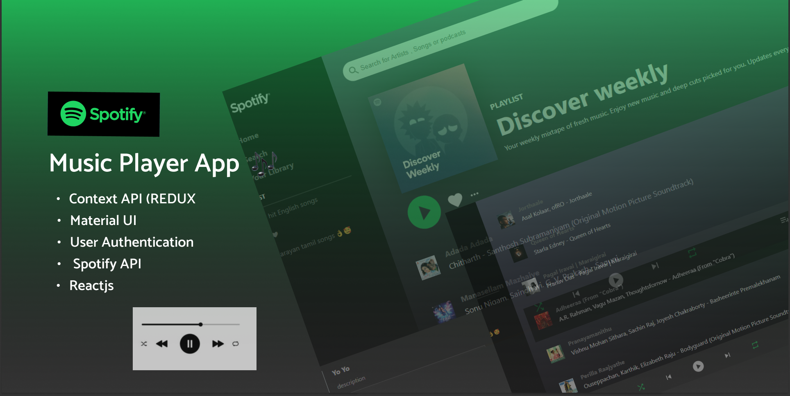

<h1 align="center">
  <br>
  <a href=""></a>
  <br>
  Spotify Clone
  <br>
</h1>

<h4 align="center">Excellent spotify app build with <a href="https://reactjs.org/" target="_blank">React js</a> and integrated with <a href="https://firebase.google.com/" target="_blank">Firebase</a>.</h4>

<p align="center">
  <a href="#about-project">About project</a> •
  <a href="#how-to-use">How To Use</a> •
  <a href="#live-link">Live link</a>
</p>



## About project

* Discover Weekly page of spotify

* Live user authentication
  - authenticate users using spotify

* Used the following major frameworks/libraries to complete the project
  - [![React][React.js]][React-url]
  - [![Firebase][Firebase]][Firebase-url]
  - [![NPM][npm]][npm-url]


## How To Use

To clone and run this application, you'll need [Git](https://git-scm.com) and [Node.js](https://nodejs.org/en/download/) (which comes with [npm](http://npmjs.com)) installed on your computer. From your command line:

```bash
# Clone this repository
$ git clone https://github.com/prasoonmohan/Spotify-clone

# Go into the repository
$ cd projects

# Install dependencies
$ npm install

# Run the app
$ npm start
```

> **Note**
> If you're using Linux Bash for Windows, [see this guide](https://www.howtogeek.com/261575/how-to-run-graphical-linux-desktop-applications-from-windows-10s-bash-shell/) or use `node` from the command prompt.

## Live Link

[spotify](https://github.com/prasoonmohan/Spotify-clone ) - Live link of the project


[React.js]: https://img.shields.io/badge/React-20232A?style=for-the-badge&logo=react&logoColor=61DAFB
[React-url]: https://reactjs.org/

[Firebase]: https://img.shields.io/badge/FIREBASE-FFF89C?style=for-the-badge&logo=firebase&logoColor=FF9F29
[Firebase-url]: https://firebase.google.com/

[Youtube]: https://img.shields.io/badge/clever%20programmer-EB1D36?style=for-the-badge&logo=Youtube&logoColor=FFFFFF
[Youtube-url]: https://www.youtube.com/c/CleverProgrammer

[npm]: https://img.shields.io/badge/NPM-FFFFFF?style=for-the-badge&logo=npm&logoColor=FFFFFF
[npm-url]: https://www.npmjs.com/package/react-router
